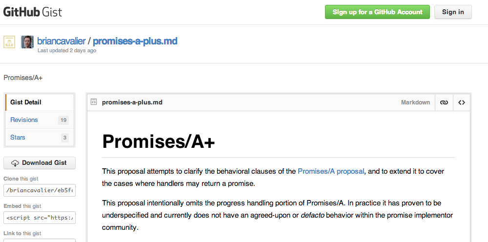

# Is this right?

```javascript
// var input = ...
try {
	var result = computeResult(input);
	displayResult(result);
} catch(e) {
	displayError(e);
}
```

---
# Let's talk about


http://www.flickr.com/photos/zanehollingsworth/5701745474

---
# Is this right?

```javascript
computeResult(input, function(e, result) {
	if(e) {
		displayError(e);
	} else {
		displayResult(result);
	}
});
```

---
# Fixed

```javascript
computeResult(input, function(e, result) {
	if(e) {
		displayError(e);
	} else {
		try {
			displayResult(result);
		} catch(e) {
			displayError(e);
		}
	}
});
```

---
# Is this right?

```javascript
function getTheResult() {

    try {
        return thisMightFail();
    } catch(e) {
        return recoverFromFailure(e);
    } finally {
        alwaysCleanup();
    }

}
```

---
# Is this right?

```javascript
function getTheResult(nodeCallback) {

    thisMightFail(function(error, result) {
        if(error) {
            try {
                result = recoverFromFailure(error);
                error = null;
            } catch(e) {
                error = e;
            }
        }

        alwaysCleanup();

        // If error is still falsey, we've succeeded
        nodeCallback(error, result);
    });
}
```

---
# Is this right?

```javascript
function getTheResult(onSuccess, onFailure) {
    thisMightFail(
        function(result) {
            try {
                onSuccess(result);
            } catch(e) {
                onFailure(e);
            } finally {
            	alwaysCleanup();
        	}
        },
        function(error) {
            var recoveryResult;
            try {
                recoveryResult = recoverFromFailure(error);
                error = null;
            } catch(e) {
                error = e;
            }

            try {
                alwaysCleanup();
            } catch(e) {
                error = e;
            }

            if(error) {
                onFailure(error);
            } else {
                onSuccess(recoveryResult);
            }
        }
    );
}
```

---


http://www.flickr.com/photos/timsnell/7986996932

---
# The problem

* Impossible to reason about and maintain
* Recreate flow control and error handling machinery

---
# Promises: The solution

## Promises give you async versions of `return` and `throw`

---
# Promises

```javascript
computeResult(input)
	.then(displayResult)
	.otherwise(displayError);
```

---
# Promises

```javascript
function getTheResult() {
    return thisMightFail()
        .otherwise(recoverFromFailure);
        .ensure(alwaysCleanup);
}
```

---
# Promises

* MultiLisp, Act 1, Prolog concurrent logic variables, Joule and E promises, `java.util.concurrent.Future`, Python Twisted deferred, Dojo `Deferred`, F# `Async<T>`, .NET `Task<T>`, C++11 `std::future` and `std::promise`, Dart `Future<T>`, Scala `Future`
* Javascript Promises/A+

---
# Just do it

* when.js
* Q
* RSVP

---
# Let's talk about


http://www.flickr.com/photos/rooners/4415074931

---
# Promises are building blocks

* map
* reduce
* map/reduce
* sequence/parallel tasks
* promisify other style async APIs

---
# Promises are building blocks

```javascript
var when = require('when');

var promise = when.reduce(
	when.map($.get('/users'), getTags), appendToFile);
```

---
# Promises are building blocks

```javascript
var nodefn = require('when/node/function');
var fs = require('fs');
var readFile = nodefn.lift(fs.readFile);
var writeFile = nodefn.lift(fs.writeFile);

var promise = writeFile('out.txt', readFile('in.txt'));
```

---
# Promises are building blocks

```javascript
// Using @domenic's chai-as-promised

expect(promise).to.eventually.equal(10);
```

---
# Let's talk about

## The future


---
```javascript
function* someNumbers() {
  yield 1;
  yield 2;
  yield 3;
}

var iterator = someNumbers();

console.log(iterator.next()); // { value: 1, done: false }
console.log(iterator.next()); // { value: 2, done: false }
console.log(iterator.next()); // { value: 3, done: false }
console.log(iterator.next()); // { done: true }
```

---
```javascript
// thisMightFail, recoverFromFailure, and
// alwaysCleanup are ASYNC!
var zomg = promisedGenerator(function* () {
	var result;

    try {
        result = yield thisMightFail();
    } catch(e) {
        result = yield recoverFromFailure(e);
    } finally {
        yield alwaysCleanup();
    }

    yield result;
});

var result = zomg();
```

---
```javascript
// ES5 (and ES3)
Users.get('brian')
	.then(function(user) {
		return user.fetchBlogPosts();
	})
	.then(function(posts) {
		return posts.toHtml();
	})
	.then(function(html) {
		container.innerHTML = html;
	});
```

```
// ES6
container.innerHTML = yield Users.brian.posts.toHtml();
```

---
# Let's talk about


http://www.flickr.com/photos/rooners/4652345494

---
# Promise aren't perfect

* VMs/platforms aren't promise-aware
* disjoint or missing stack traces
* when.js and Q can trap and report unhandled rejections
	* and *stitch stack traces*

---
# Promise pitfalls

* `return` something!!
* Don't break the chain
* rejection handlers work like `catch`, if you don't rethrow, the error is considered "handled" and won't propagate
	* This is a *good thing*

---
# Code smells

```javascript
// You sly dog:
// If doSomething fails, no one will ever know
promise.then(doSomething);
return promise;
```

---
# Code smells

```javascript
// Oops, you returned `undefined` which
// turns this rejection into a success
return promise.otherwise(function(e) {
	logError(e);
});
```

```javascript
// It's the async version of this:
try {
	// ...
	return getUsefulResult();
} catch(e) {
	logError(e);
	return;
}
```

---
# Let's talk about


http://www.flickr.com/photos/pelegrino/6884873348

---
# Aristotle: Poetics

* Exposition
* Inciting incident
* Rising action
* Climax

---
# Exposition


http://wiki.commonjs.org/wiki/Promises/A

---
# Inciting incident

## Deceit!


https://github.com/jquery/jquery/commit/a41f2406748e3113751ab1e5b5d990d9144123fc

---


---
# Rising action

## Complications!


https://github.com/emberjs/ember.js/pull/1406

---
# Rising action

## Conflict!


https://gist.github.com/domenic/3889970

---
# Rising action

## Heroics!


https://github.com/domenic/promise-tests

---
# Rising action

## Action!



https://gist.github.com/briancavalier/eb5fc157825a170c9957

---
# Boom!

## Explosions!

[](http://promisesaplus.com)

http://promisesaplus.com

---
# Promises/A+ test suite


https://github.com/promises-aplus/promises-tests

---
# Promises/A+ stats

* 33 verified implementations, more every week
* Several "inspired by Promises/A+" *in other languages*

---
# DOM Promises


http://dom.spec.whatwg.org/#promises

---
# ES7

## Slated to have Promises as a language feature


---

# Wait, what?!?

## How did all this happen in about 6 months

---
# Aristotle: Poetics

* Plot
* Character
* Theme
* Diction
* Setting (music, spectacle)

---
# Plot

## Sane JavaScript asynchrony

---
# Character

## Strong and cooperative community of implementors and users

---
# Theme

## Extend the web forward

---
# Diction

## Minimal spec for sanity and interoperability

---
# Setting

## Github

---
# Promises/A+

## An open standard for sound, interoperable JavaScript promises&mdash;by implementers, for implementers.

---
# Thanks!

[@briancavalier](http://twitter.com/briancavalier)

SpringJS @ Pivotal

[cujoJS](http://cujojs.com) co-founder

[promisesaplus.com](http://promisesaplus.com) co-editor

[@promisesaplus](http://twitter.com/promisesaplus)